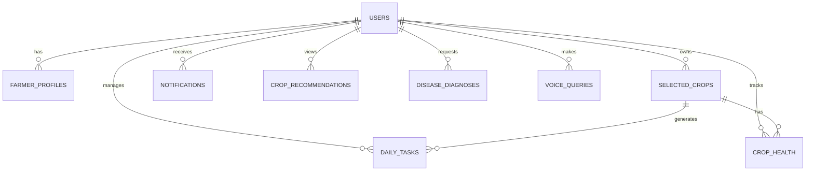

# FarmVoice Pro - Comprehensive Project Analysis Report

**Project Name:** FarmVoice Pro  
**Analysis Date:** December 26, 2025  
**Version:** 1.0.0  
**License:** MIT

---

## Executive Summary

FarmVoice Pro is an **AI-powered agricultural assistant** designed to help farmers with voice-based interactions, crop recommendations, disease diagnosis, real-time market insights, and weather integration. The application features a modern full-stack architecture with a Next.js frontend and FastAPI backend, leveraging AI/ML capabilities through Google Gemini API and Ollama (local LLM).

---

## 1. Technology Stack

| Layer                  | Technology                | Version |
| ---------------------- | ------------------------- | ------- |
| **Frontend Framework** | Next.js                   | 15.1.0  |
| **UI Library**         | React                     | 19.0.0  |
| **Language**           | TypeScript                | 5.7.2   |
| **Styling**            | Tailwind CSS              | 3.4.17  |
| **Animation**          | Framer Motion             | 11.15.0 |
| **Charts**             | Recharts                  | 2.15.0  |
| **Icons**              | React Icons               | 5.4.0   |
| **Backend Framework**  | FastAPI                   | 0.115.5 |
| **Python Runtime**     | Python                    | 3.11+   |
| **Server**             | Uvicorn                   | 0.34.0  |
| **Database**           | Supabase (PostgreSQL)     | -       |
| **AI/ML**              | Google Gemini API         | 0.8.3   |
| **Local LLM**          | Ollama                    | 0.4.4   |
| **Voice (STT)**        | faster-whisper (optional) | -       |
| **Serverless Adapter** | Mangum                    | 0.19.0  |

---

## 2. Project Structure Overview

```
farmvoicePro/
├── app/                    # Next.js App Router pages (21 items)
│   ├── crop-selection/     # Crop selection page
│   ├── home/               # Main dashboard with 14 sub-pages
│   │   ├── analytics/
│   │   ├── crop-calendar/
│   │   ├── crop-recommendation/
│   │   ├── disease-management/
│   │   ├── farming-tips/
│   │   ├── govt-schemes/
│   │   ├── health/
│   │   ├── market-prices/
│   │   ├── nearby-mandis/
│   │   ├── profile/
│   │   ├── tasks/
│   │   ├── voice-assistant/
│   │   ├── voice-queries/
│   │   └── weather/
│   ├── personal-details/   # User onboarding
│   ├── settings/           # App settings
│   ├── globals.css         # 5,724 bytes
│   ├── layout.tsx          # Root layout
│   └── page.tsx            # Landing/Login page
├── backend/                # FastAPI backend (49 items)
│   ├── main.py             # 72,436 bytes, 1,791 lines
│   ├── routers/            # 5 API routers
│   ├── services/           # 6 business logic services
│   ├── models/             # Data models (whisper subdirectory)
│   ├── voice_service/      # 11 voice-related modules
│   ├── web_scraper.py      # 45,282 bytes, 932 lines
│   ├── crop_recommender.py # 14,007 bytes
│   ├── supabase_schema.sql # Database schema
│   └── tests/              # Backend tests
├── components/             # 18 React components
├── context/                # React Context providers
├── lib/                    # 4 utility modules
├── public/                 # Static assets
├── styles/                 # Additional styles
├── tests/                  # Frontend tests
└── types/                  # TypeScript type definitions
```

---

## 3. Frontend Architecture

### 3.1 React Components (18 Total)

| Component                                                                                                           | Size         | Purpose                         |
| ------------------------------------------------------------------------------------------------------------------- | ------------ | ------------------------------- |
| [CropSelection.tsx](file:///c:/Users/P.SUDHAKAR BABU/Downloads/farmvoicePro/components/CropSelection.tsx)           | 35,793 bytes | Crop selection wizard           |
| [HomePage.tsx](file:///c:/Users/P.SUDHAKAR BABU/Downloads/farmvoicePro/components/HomePage.tsx)                     | 31,424 bytes | Main dashboard (628 lines)      |
| [CropDetailsModal.tsx](file:///c:/Users/P.SUDHAKAR BABU/Downloads/farmvoicePro/components/CropDetailsModal.tsx)     | 30,546 bytes | Detailed crop information modal |
| [CropDashboard.tsx](file:///c:/Users/P.SUDHAKAR BABU/Downloads/farmvoicePro/components/CropDashboard.tsx)           | 20,077 bytes | Crop management dashboard       |
| [Onboarding.tsx](file:///c:/Users/P.SUDHAKAR BABU/Downloads/farmvoicePro/components/Onboarding.tsx)                 | 16,483 bytes | User onboarding flow            |
| [VoiceAssistant.tsx](file:///c:/Users/P.SUDHAKAR BABU/Downloads/farmvoicePro/components/VoiceAssistant.tsx)         | 13,639 bytes | Voice interaction (409 lines)   |
| [DiseaseManagement.tsx](file:///c:/Users/P.SUDHAKAR BABU/Downloads/farmvoicePro/components/DiseaseManagement.tsx)   | 13,442 bytes | Disease diagnosis UI            |
| [WeatherWidget.tsx](file:///c:/Users/P.SUDHAKAR BABU/Downloads/farmvoicePro/components/WeatherWidget.tsx)           | 9,924 bytes  | Weather display widget          |
| [LoginPage.tsx](file:///c:/Users/P.SUDHAKAR BABU/Downloads/farmvoicePro/components/LoginPage.tsx)                   | 9,308 bytes  | Authentication UI               |
| [ProfilePage.tsx](file:///c:/Users/P.SUDHAKAR BABU/Downloads/farmvoicePro/components/ProfilePage.tsx)               | 8,713 bytes  | User profile management         |
| [DailyTasks.tsx](file:///c:/Users/P.SUDHAKAR BABU/Downloads/farmvoicePro/components/DailyTasks.tsx)                 | 7,627 bytes  | Task management UI              |
| [CropHealthChart.tsx](file:///c:/Users/P.SUDHAKAR BABU/Downloads/farmvoicePro/components/CropHealthChart.tsx)       | 7,705 bytes  | Health visualization            |
| [CropRecommendation.tsx](file:///c:/Users/P.SUDHAKAR BABU/Downloads/farmvoicePro/components/CropRecommendation.tsx) | 7,026 bytes  | Crop suggestions UI             |
| [Market.tsx](file:///c:/Users/P.SUDHAKAR BABU/Downloads/farmvoicePro/components/Market.tsx)                         | 6,861 bytes  | Market prices display           |
| [DashboardStats.tsx](file:///c:/Users/P.SUDHAKAR BABU/Downloads/farmvoicePro/components/DashboardStats.tsx)         | 6,250 bytes  | Statistics widgets              |
| [Notifications.tsx](file:///c:/Users/P.SUDHAKAR BABU/Downloads/farmvoicePro/components/Notifications.tsx)           | 4,741 bytes  | Notification center             |
| [Sidebar.tsx](file:///c:/Users/P.SUDHAKAR BABU/Downloads/farmvoicePro/components/Sidebar.tsx)                       | 3,977 bytes  | Navigation sidebar              |
| [Loading3D.tsx](file:///c:/Users/P.SUDHAKAR BABU/Downloads/farmvoicePro/components/Loading3D.tsx)                   | 1,456 bytes  | 3D loading animation            |

### 3.2 Utility Libraries

| File                                                                                                 | Size         | Purpose                       |
| ---------------------------------------------------------------------------------------------------- | ------------ | ----------------------------- |
| [translations.ts](file:///c:/Users/P.SUDHAKAR BABU/Downloads/farmvoicePro/lib/translations.ts)       | 31,788 bytes | Multi-language support        |
| [api.ts](file:///c:/Users/P.SUDHAKAR BABU/Downloads/farmvoicePro/lib/api.ts)                         | 7,788 bytes  | API client (25 methods)       |
| [audio-recorder.ts](file:///c:/Users/P.SUDHAKAR BABU/Downloads/farmvoicePro/lib/audio-recorder.ts)   | 6,406 bytes  | Audio recording utilities     |
| [voice-websocket.ts](file:///c:/Users/P.SUDHAKAR BABU/Downloads/farmvoicePro/lib/voice-websocket.ts) | 5,639 bytes  | WebSocket voice communication |

### 3.3 Context Providers

| File                                                                                                       | Purpose                                    |
| ---------------------------------------------------------------------------------------------------------- | ------------------------------------------ |
| [SettingsContext.tsx](file:///c:/Users/P.SUDHAKAR BABU/Downloads/farmvoicePro/context/SettingsContext.tsx) | Theme, language, and notification settings |

### 3.4 Design System

- **Theme Support:** Light/Dark mode with class-based switching
- **Color Palette:** Custom primary green scale (50-900)
- **Animations:** Custom blob animation, Framer Motion transitions
- **Responsive:** Mobile-first design approach

---

## 4. Backend Architecture

### 4.1 Main Application ([main.py](file:///c:/Users/P.SUDHAKAR BABU/Downloads/farmvoicePro/backend/main.py))

**Size:** 72,436 bytes | **Lines:** 1,791 | **Functions/Classes:** 75+

#### Pydantic Models (Data Structures)

| Model                       | Fields                                                                                                                                                             |
| --------------------------- | ------------------------------------------------------------------------------------------------------------------------------------------------------------------ |
| `UserRegister`              | email, password, name                                                                                                                                              |
| `UserLogin`                 | email, password                                                                                                                                                    |
| `Token`                     | access_token, token_type, user                                                                                                                                     |
| `CropRecommendationRequest` | soil_type, climate, season                                                                                                                                         |
| `CropRecommendation`        | name, suitability, description, benefits                                                                                                                           |
| `DiseaseDiagnosisRequest`   | crop, symptoms, image_url                                                                                                                                          |
| `DiseaseDiagnosis`          | name, severity, description, treatment, prevention                                                                                                                 |
| `VoiceQuery`                | query, language                                                                                                                                                    |
| `VoiceResponse`             | response, suggestions                                                                                                                                              |
| `FarmerProfile`             | full_name, phone, location_address, pincode, latitude, longitude, acres_of_land, location_permission, microphone_permission, onboarding_completed                  |
| `PincodeRequest`            | pincode                                                                                                                                                            |
| `CropNameRequest`           | crop_name, pincode                                                                                                                                                 |
| `CropSelectRequest`         | crop_name, name, crop_variety, planting_date, acres_allocated, suitability_score, is_suitable, crop_details, farming_guide, disease_predictions, profit_estimation |
| `VoiceChatRequest`          | text, lat, lon, lang                                                                                                                                               |
| `ThemeRequest`              | theme                                                                                                                                                              |

#### Key API Endpoints

| Category          | Endpoint                         | Method    | Description                    |
| ----------------- | -------------------------------- | --------- | ------------------------------ |
| **Health**        | `/`                              | GET       | Root endpoint                  |
| **Health**        | `/health`                        | GET       | Health check                   |
| **Auth**          | `/api/auth/register`             | POST      | User registration              |
| **Auth**          | `/api/auth/login`                | POST      | User login                     |
| **Auth**          | `/api/auth/me`                   | GET       | Current user info              |
| **Crops**         | `/api/crop/recommend`            | POST      | Basic crop recommendations     |
| **Crops**         | `/api/crop/recommend-by-pincode` | POST      | Location-based recommendations |
| **Crops**         | `/api/crop/check-suitability`    | POST      | Crop suitability check         |
| **Crops**         | `/api/crop/select`               | POST      | Select crop for farming        |
| **Crops**         | `/api/crops/selected`            | GET       | Get selected crops             |
| **Disease**       | `/api/disease/diagnose`          | POST      | Disease diagnosis              |
| **Disease**       | `/api/disease/predict`           | POST      | Disease prediction (scraping)  |
| **Disease**       | `/api/disease-risk-forecast`     | GET       | Risk forecast                  |
| **Market**        | `/api/market/prices`             | GET       | Market prices                  |
| **Weather**       | `/api/weather`                   | GET       | Weather data                   |
| **Weather**       | `/api/current-weather`           | GET       | Current weather (scraped)      |
| **Tasks**         | `/api/tasks`                     | GET       | Daily tasks (tab-based)        |
| **Tasks**         | `/api/daily-tasks`               | GET       | Farmer tasks                   |
| **Profile**       | `/api/farmer/profile`            | GET/POST  | Farmer profile CRUD            |
| **Profile**       | `/api/location/pincode`          | GET       | Pincode location data          |
| **Notifications** | `/api/notifications`             | GET       | User notifications             |
| **Dashboard**     | `/api/home/init`                 | GET       | Dashboard initialization       |
| **Dashboard**     | `/api/dashboard/stats`           | GET       | Dashboard statistics           |
| **Voice**         | `/api/voice/query`               | POST      | Process voice query            |
| **Voice**         | `/api/voice/chat`                | POST      | Text-based voice chat          |
| **Voice**         | `/ws/voice`                      | WebSocket | Real-time voice communication  |
| **Voice**         | `/api/voice/action`              | POST      | Handle canvas actions          |
| **Settings**      | `/api/settings/theme`            | POST      | Change UI theme                |

### 4.2 API Routers

| Router                                                                                                           | Size         | Purpose                     |
| ---------------------------------------------------------------------------------------------------------------- | ------------ | --------------------------- |
| [features_router.py](file:///c:/Users/P.SUDHAKAR BABU/Downloads/farmvoicePro/backend/routers/features_router.py) | 17,581 bytes | Extended feature endpoints  |
| [home_router.py](file:///c:/Users/P.SUDHAKAR BABU/Downloads/farmvoicePro/backend/routers/home_router.py)         | 3,590 bytes  | Dashboard home endpoints    |
| [voice_router.py](file:///c:/Users/P.SUDHAKAR BABU/Downloads/farmvoicePro/backend/routers/voice_router.py)       | 2,846 bytes  | Voice assistant endpoints   |
| [disease_router.py](file:///c:/Users/P.SUDHAKAR BABU/Downloads/farmvoicePro/backend/routers/disease_router.py)   | 1,476 bytes  | Disease diagnosis endpoints |
| [market_router.py](file:///c:/Users/P.SUDHAKAR BABU/Downloads/farmvoicePro/backend/routers/market_router.py)     | 1,290 bytes  | Market price endpoints      |

### 4.3 Business Services

| Service                                                                                                           | Size        | Purpose                 |
| ----------------------------------------------------------------------------------------------------------------- | ----------- | ----------------------- |
| [task_repository.py](file:///c:/Users/P.SUDHAKAR BABU/Downloads/farmvoicePro/backend/services/task_repository.py) | 5,755 bytes | Task data persistence   |
| [weather_service.py](file:///c:/Users/P.SUDHAKAR BABU/Downloads/farmvoicePro/backend/services/weather_service.py) | 5,197 bytes | Weather data fetching   |
| [task_engine.py](file:///c:/Users/P.SUDHAKAR BABU/Downloads/farmvoicePro/backend/services/task_engine.py)         | 4,109 bytes | Task generation logic   |
| [soil_service.py](file:///c:/Users/P.SUDHAKAR BABU/Downloads/farmvoicePro/backend/services/soil_service.py)       | 2,682 bytes | Soil data analysis      |
| [market_service.py](file:///c:/Users/P.SUDHAKAR BABU/Downloads/farmvoicePro/backend/services/market_service.py)   | 2,405 bytes | Market price logic      |
| [disease_engine.py](file:///c:/Users/P.SUDHAKAR BABU/Downloads/farmvoicePro/backend/services/disease_engine.py)   | 2,117 bytes | Disease detection logic |

### 4.4 Voice Service Module (11 Files)

| File                                                                                                                       | Size         | Purpose                     |
| -------------------------------------------------------------------------------------------------------------------------- | ------------ | --------------------------- |
| [websocket_handler.py](file:///c:/Users/P.SUDHAKAR BABU/Downloads/farmvoicePro/backend/voice_service/websocket_handler.py) | 11,541 bytes | WebSocket management        |
| [canvas_builder.py](file:///c:/Users/P.SUDHAKAR BABU/Downloads/farmvoicePro/backend/voice_service/canvas_builder.py)       | 11,343 bytes | UI canvas generation        |
| [observability.py](file:///c:/Users/P.SUDHAKAR BABU/Downloads/farmvoicePro/backend/voice_service/observability.py)         | 8,547 bytes  | Logging & monitoring        |
| [config.py](file:///c:/Users/P.SUDHAKAR BABU/Downloads/farmvoicePro/backend/voice_service/config.py)                       | 8,423 bytes  | Voice service configuration |
| [planner.py](file:///c:/Users/P.SUDHAKAR BABU/Downloads/farmvoicePro/backend/voice_service/planner.py)                     | 7,114 bytes  | Query planning              |
| [cache_manager.py](file:///c:/Users/P.SUDHAKAR BABU/Downloads/farmvoicePro/backend/voice_service/cache_manager.py)         | 5,602 bytes  | Response caching            |
| [stt_service.py](file:///c:/Users/P.SUDHAKAR BABU/Downloads/farmvoicePro/backend/voice_service/stt_service.py)             | 5,251 bytes  | Speech-to-Text              |
| [tts_service.py](file:///c:/Users/P.SUDHAKAR BABU/Downloads/farmvoicePro/backend/voice_service/tts_service.py)             | 4,320 bytes  | Text-to-Speech              |
| [llm_service.py](file:///c:/Users/P.SUDHAKAR BABU/Downloads/farmvoicePro/backend/voice_service/llm_service.py)             | 3,492 bytes  | LLM integration             |
| [tool_adapters.py](file:///c:/Users/P.SUDHAKAR BABU/Downloads/farmvoicePro/backend/voice_service/tool_adapters.py)         | 3,147 bytes  | Tool integration            |
| [__init__.py](file:///c:/Users/P.SUDHAKAR BABU/Downloads/farmvoicePro/backend/voice_service/**init**.py)                   | 223 bytes    | Module exports              |

### 4.5 Web Scraper ([web_scraper.py](file:///c:/Users/P.SUDHAKAR BABU/Downloads/farmvoicePro/backend/web_scraper.py))

**Size:** 45,282 bytes | **Lines:** 932 | **Functions:** 20

| Function                           | Purpose                                 |
| ---------------------------------- | --------------------------------------- |
| `get_pincode_data()`               | Fetch location data from Indian pincode |
| `extract_region_from_name()`       | Extract region from location name       |
| `extract_state_from_name()`        | Extract state information               |
| `extract_district_from_name()`     | Extract district information            |
| `get_soil_data_from_soilgrids()`   | Fetch soil data from SoilGrids API      |
| `get_crops_for_soil_type()`        | Get suitable crops for soil             |
| `classify_soil_type()`             | USDA texture triangle classification    |
| `determine_soil_type()`            | Region-based soil determination         |
| `determine_climate()`              | Region-based climate determination      |
| `get_weather_data()`               | Real-time weather from Open-Meteo       |
| `determine_agricultural_season()`  | Seasonal determination                  |
| `get_weather_condition()`          | WMO code to condition mapping           |
| `get_fallback_weather()`           | Fallback weather data                   |
| `get_suitable_crops_for_region()`  | Government data-based recommendations   |
| `get_fallback_pincode_data()`      | Fallback pincode patterns               |
| `get_location_data_from_coords()`  | Reverse geocoding                       |
| `get_market_prices_for_location()` | Market price scraping                   |
| `scrape_plant_diseases()`          | Disease information scraping            |
| `get_disease_fallback_data()`      | Internal disease database               |

**Data Sources:**

- OpenStreetMap (Geocoding)
- SoilGrids API (Soil data)
- Open-Meteo API (Weather)
- Vikaspedia/TNAU Agritech (Disease info)

---

## 5. Database Schema

### 5.1 Tables Overview (10 Tables)



### 5.2 Table Details

#### `users`

| Column        | Type         | Description            |
| ------------- | ------------ | ---------------------- |
| id            | UUID         | Primary key            |
| email         | VARCHAR(255) | Unique email           |
| password_hash | TEXT         | Bcrypt hashed password |
| name          | VARCHAR(255) | Display name           |
| created_at    | TIMESTAMP    | Creation time          |
| updated_at    | TIMESTAMP    | Last update            |

#### `farmer_profiles`

| Column                | Type          | Description          |
| --------------------- | ------------- | -------------------- |
| id                    | UUID          | Primary key          |
| user_id               | UUID          | Foreign key to users |
| full_name             | VARCHAR(255)  | Full name            |
| phone                 | VARCHAR(20)   | Phone number         |
| location_address      | TEXT          | Address              |
| pincode               | VARCHAR(10)   | Indian postal code   |
| latitude              | DECIMAL(10,8) | GPS latitude         |
| longitude             | DECIMAL(11,8) | GPS longitude        |
| region                | VARCHAR(100)  | Geographic region    |
| state                 | VARCHAR(100)  | State name           |
| district              | VARCHAR(100)  | District name        |
| acres_of_land         | DECIMAL(10,2) | Farm size            |
| soil_type             | VARCHAR(50)   | Soil classification  |
| climate_type          | VARCHAR(50)   | Climate zone         |
| location_permission   | BOOLEAN       | GPS permission       |
| microphone_permission | BOOLEAN       | Mic permission       |
| onboarding_completed  | BOOLEAN       | Onboarding status    |

#### `selected_crops`

| Column                | Type          | Description             |
| --------------------- | ------------- | ----------------------- |
| id                    | UUID          | Primary key             |
| user_id               | UUID          | Foreign key to users    |
| crop_name             | VARCHAR(100)  | Crop name               |
| crop_variety          | VARCHAR(100)  | Variety/cultivar        |
| planting_date         | DATE          | Planting date           |
| expected_harvest_date | DATE          | Expected harvest        |
| acres_allocated       | DECIMAL(10,2) | Area allocated          |
| suitability_score     | INTEGER       | AI suitability score    |
| is_suitable           | BOOLEAN       | Suitability flag        |
| crop_details          | JSONB         | Detailed crop info      |
| farming_guide         | JSONB         | Farming instructions    |
| disease_predictions   | JSONB         | Disease forecast        |
| profit_estimation     | JSONB         | Profit projections      |
| status                | VARCHAR(50)   | active/harvested/failed |

#### `daily_tasks`

| Column           | Type         | Description                   |
| ---------------- | ------------ | ----------------------------- |
| id               | UUID         | Primary key                   |
| user_id          | UUID         | Foreign key to users          |
| crop_id          | UUID         | Foreign key to selected_crops |
| task_name        | VARCHAR(255) | Task title                    |
| task_description | TEXT         | Task details                  |
| task_type        | VARCHAR(50)  | Task category                 |
| scheduled_date   | DATE         | Scheduled date                |
| completed        | BOOLEAN      | Completion status             |
| completed_at     | TIMESTAMP    | Completion time               |
| priority         | VARCHAR(20)  | high/medium/low               |

#### `notifications`

| Column     | Type         | Description          |
| ---------- | ------------ | -------------------- |
| id         | UUID         | Primary key          |
| user_id    | UUID         | Foreign key to users |
| title      | VARCHAR(255) | Notification title   |
| message    | TEXT         | Notification body    |
| type       | VARCHAR(50)  | Notification type    |
| priority   | VARCHAR(20)  | Priority level       |
| read       | BOOLEAN      | Read status          |
| action_url | TEXT         | Action link          |

#### Additional Tables

- **`crop_health`** - Health score tracking with images
- **`crop_recommendations`** - AI-generated recommendations
- **`disease_diagnoses`** - Disease diagnosis history
- **`voice_queries`** - Voice interaction logs
- **`market_prices`** - Commodity price data

---

## 6. Key Features

### 6.1 Voice Assistant

- **Web Speech API** integration for browser-based STT
- **WebSocket** real-time communication (`/ws/voice`)
- **REST fallback** via `/api/voice/query`
- **Multi-language support** (translations.ts - 31KB)
- **TTS** response playback
- Optional **faster-whisper** for server-side STT

### 6.2 Crop Recommendation Engine

- **Pincode-based** location detection
- **Soil analysis** via SoilGrids API
- **Weather integration** via Open-Meteo
- **AI-powered** suitability scoring
- **Government data** patterns for regional crops

### 6.3 Disease Diagnosis

- **Symptom-based** analysis
- **Image upload** support (optional)
- **Web scraping** from agricultural databases
- **Treatment recommendations**
- **Prevention guidelines**

### 6.4 Market Intelligence

- **Real-time prices** from commodity sources
- **Trend analysis** (up/down/stable)
- **Location-specific** market data
- **Price alerts** via notifications

### 6.5 Task Management

- **AI-generated** daily tasks based on crop stage
- **Weather-aware** task scheduling
- **Tab-based navigation** (yesterday/today/tomorrow)
- **Health index** calculation based on task completion
- **Priority management**

### 6.6 Weather Integration

- **Open-Meteo API** for real-time data
- **Location-based** forecasts
- **Agricultural season** detection
- **Weather-based** task recommendations
- **Caching** for performance (`weather_cache.json`)

---

## 7. Authentication & Security

### 7.1 Authentication Flow

- **JWT-based** authentication
- **Bcrypt** password hashing with 72-byte truncation
- **HTTPBearer** security scheme
- **Token storage** in localStorage

### 7.2 Environment Variables

| Variable               | Purpose               |
| ---------------------- | --------------------- |
| `SUPABASE_URL`         | Database connection   |
| `SUPABASE_KEY`         | Supabase anon key     |
| `SUPABASE_SERVICE_KEY` | Service role key      |
| `JWT_SECRET_KEY`       | Token signing         |
| `JWT_ALGORITHM`        | HS256                 |
| `CORS_ORIGINS`         | Allowed origins       |
| `NEXT_PUBLIC_API_URL`  | Frontend API base     |
| `GOOGLE_API_KEY`       | Gemini API (optional) |
| `OLLAMA_HOST`          | Local LLM (optional)  |

---

## 8. Deployment Configuration

### 8.1 Vercel

- [vercel.json](file:///c:/Users/P.SUDHAKAR BABU/Downloads/farmvoicePro/vercel.json) - Deployment config
- [.vercelignore](file:///c:/Users/P.SUDHAKAR BABU/Downloads/farmvoicePro/.vercelignore) - Ignore patterns

### 8.2 Netlify

- [netlify.toml](file:///c:/Users/P.SUDHAKAR BABU/Downloads/farmvoicePro/netlify.toml) - Build settings
- `netlify/` folder for function deployment

### 8.3 Scripts

- `npm run dev` - Start frontend dev server
- `npm run build` - Production build
- `uvicorn main:app --reload` - Start backend
- `pytest` - Run backend tests

---

## 9. Testing

### 9.1 Backend Tests

| File                                                                                                                 | Size        | Purpose               |
| -------------------------------------------------------------------------------------------------------------------- | ----------- | --------------------- |
| [test_personalized_home.py](file:///c:/Users/P.SUDHAKAR BABU/Downloads/farmvoicePro/tests/test_personalized_home.py) | 2,591 bytes | Home page tests       |
| [verify_scenarios.py](file:///c:/Users/P.SUDHAKAR BABU/Downloads/farmvoicePro/tests/verify_scenarios.py)             | 7,102 bytes | Scenario verification |

### 9.2 Test Commands

```bash
# Backend tests
cd backend
pytest

# Frontend build test
npm run build
```

---

## 10. File Statistics Summary

### 10.1 Total Files by Type

| Type           | Count |
| -------------- | ----- |
| TypeScript/TSX | 25+   |
| Python         | 30+   |
| SQL            | 3     |
| JSON           | 5+    |
| Markdown       | 3     |
| Configuration  | 8+    |

### 10.2 Largest Files

| File                         | Size         | Lines |
| ---------------------------- | ------------ | ----- |
| backend/main.py              | 72,436 bytes | 1,791 |
| openapi_routes.json          | 55,516 bytes | -     |
| backend/web_scraper.py       | 45,282 bytes | 932   |
| components/CropSelection.tsx | 35,793 bytes | -     |
| lib/translations.ts          | 31,788 bytes | -     |
| components/HomePage.tsx      | 31,424 bytes | 628   |

---

## 11. Dependencies

### 11.1 Frontend (package.json)

**Production:**

- `next`: ^15.1.0
- `react`: ^19.0.0
- `react-dom`: ^19.0.0
- `framer-motion`: ^11.15.0
- `react-icons`: ^5.4.0
- `recharts`: ^2.15.0

**Development:**

- `typescript`: ^5.7.2
- `tailwindcss`: ^3.4.17
- `postcss`: ^8.4.49
- `autoprefixer`: ^10.4.20
- `@types/node`: ^22.10.2
- `@types/react`: ^19.0.2
- `@types/react-dom`: ^19.0.2

### 11.2 Backend (requirements.txt)

**Core:**

- `fastapi`: 0.115.5
- `uvicorn[standard]`: 0.34.0
- `python-dotenv`: 1.0.1
- `pydantic`: 2.10.4

**Database & Auth:**

- `supabase`: 2.11.0
- `python-jose[cryptography]`: 3.3.0
- `passlib[bcrypt]`: 1.7.4
- `bcrypt`: 4.2.1

**HTTP & Web:**

- `httpx`: 0.28.1
- `python-multipart`: 0.0.18
- `beautifulsoup4`: 4.12.3

**AI & ML:**

- `google-generativeai`: 0.8.3
- `ollama`: 0.4.4

**Voice:**

- `websockets`: 14.1
- `aiofiles`: 24.1.0
- `numpy`: >=1.26.0

**Serverless:**

- `mangum`: 0.19.0

---

## 12. Recommendations

### 12.1 Code Quality

1. Consider splitting `main.py` (1,791 lines) into smaller modules
2. Add TypeScript strict mode for better type safety
3. Implement comprehensive error boundaries in React

### 12.2 Performance

1. Implement Redis caching for API responses
2. Add database connection pooling
3. Optimize image assets and implement lazy loading

### 12.3 Security

1. Implement rate limiting on authentication endpoints
2. Add CSRF protection for state-changing operations
3. Consider moving sensitive logic to edge functions

### 12.4 Documentation

1. Add JSDoc comments to TypeScript functions
2. Create API documentation with examples
3. Add architecture decision records (ADRs)

---

## 13. Quick Reference

### Start Development

```bash
# Frontend (Terminal 1)
npm install
npm run dev

# Backend (Terminal 2)
cd backend
pip install -r requirements.txt
uvicorn main:app --reload
```

### URLs

- Frontend: http://localhost:3000
- Backend API: http://localhost:8000
- API Docs: http://localhost:8000/docs

---

**Report Generated:** December 26, 2025  
**Analysis Tool:** Antigravity AI Assistant
